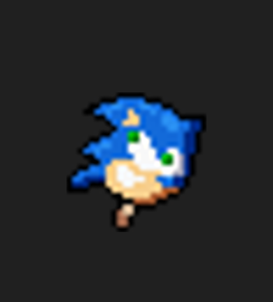

# TONYC

## Equipo
- David Oliva
- Luis Miguel López
- Aaron Gómez

# Índice

- [TONYC](#tonyc)
  - [Equipo](#equipo)
- [Índice](#índice)
  - [Descripción](#descripción)
  - [Conceptualización](#conceptualización)
    - [Idea principal](#idea-principal)
    - [Mecánicas](#mecánicas)
    - [Controles](#controles)
  - [Arte](#arte)
    - [Estilo visual](#estilo-visual)
    - [Title Map](#title-map)
    - [Recursos gráficos](#recursos-gráficos)
      - [Personaje (Tonyc):](#personaje-tonyc)
      - [Enemigos](#enemigos)
      - [Coleccionables](#coleccionables)
      - [Pantallas](#pantallas)
    - [Sonido](#sonido)
  - [Programación](#programación)
    - [Estructura del proyecto](#estructura-del-proyecto)
  - [Elementos destacables del desarrollo (innovaciones y problemas)](#elementos-destacables-del-desarrollo-innovaciones-y-problemas)
    - [Implementacion de Fisicas](#implementacion-de-fisicas)
    - [Implementacion del modo Bola](#implementacion-del-modo-bola)
    - [Implementacion del spawn de enemigos](#implementacion-del-spawn-de-enemigos)


---

## Descripción
Este juego llamado **Tonyc** es un juego inspirado en el videojuego Sonic basado en plataformas, el juego trata de el personaje principal intentando salvar a su amigo **Tails** de las manos del doctor **EggMan**, para ello deberá sortear todo tipo de obstaculos que hay en el mapa y conseguir todas las monedas para poder abrir la jaula donde se encuentra encarcelado **Tails**.

---

## Conceptualización

### Idea principal
- Es un juego basado en plataformas.
- El juego esta inspirado en Sonic.
- Salvar a su amigo Tails.

### Mecánicas
- **Movimiento del personaje**: Estaran implentados mediante Assets de andar, correr, y bola
- **Salto**: Esta implementado un salto
- **Recolección de monedas**: El personaje recolecta monedas y se indican mediante un contador.
- **Enemigos**: Hay 3 tipos de enemigos, 1 estatico(**Pinchos**) y 2 dinamicos(**Mosquito**: El cual sigue al jugador) y (**Dr. EggMan**: El cual te ataca y spawnea a los **Mosquitos**).
- **Sistema de daño/muerte**: Tenemos implementadas 3 vidas, las cuales pueden aumentar mediante un objeto recolectable que suma una vida, y si te tocan todo tipo de enemigos pierdes una vida y volverás al inicio del juego. Cuando se pierdan todas las vidas se mostrará una pantalla de muerte con la que podras reiniciar el juego o volver al menu principal.

### Controles
- **Flecha derecha**: Mover el personaje hacia la derecha.
- **Flecha izquierda**: Mover el personaje hacia la izquierda.
- **Flecha de abajo**: Empezar el rodamiento de bola cuando haya inercia suficiente para iniciar este movimiento.
- **Flecha de abajo**: Parar el movimiento de bola cuando este este en funcionamiento.
- **Barra Espaciadora**: Salto del personaje.

---

## Arte

### Estilo visual
- Pixel art / 2D / retro
- Colores usados: Colores claros(Azul, verde, amarillo)

### Title Map

**Assets Utilizados:**


### Recursos gráficos
#### Personaje (Tonyc):
**Tonyc Reposo:**


**Tonyc Correr:**


**Tonyc Morir:**


**Tonyc Bola:**


**Tonyc Correr Rapido:**


**Tonyc Deslizar:**


**Tonyc Saltar:**


**Tonyc Victoria:**


#### Enemigos

**Dr. Eggman:**


**Mosquito:**


#### Coleccionables
**Monedas:**


**Batido:**



#### Pantallas
**Menu:**


**Pantalla de Muerte:**


**Fondo:**


### Sonido
- Música del menú
- Música de muerte
- Música de victoria
- Sonido de monedas

---

## Programación

### Estructura del proyecto
```text
res://
├── coleccionables
│   ├── moneda
│   └── vidas
├── enemigos
│   ├── ene_mosca
│   ├── ene_mregg
│   └── pinchos
├── entorno
│   ├── contador
│   ├── contador_vidas
│   ├── environment
│   └── fondo
├── jugador_sonic
│   ├── img
│   ├── jugador_sonic.gd
│   ├── jugador_sonic.tscn
│   └── victoria.mp3
├── menus
│   ├── menu
│   └── menu_muerte
└── tiles
    ├── img
    ├── tiles.gd
    └── tiles.tscn
```


## Elementos destacables del desarrollo (innovaciones y problemas)

### Implementacion de Fisicas

Implentación de fisicas para la fluidez de rampas y cuestas mediante la inercia de la bajada y la subida. 


Cabe decir que en gotod se nos hizo bastante complicado el tema de hacer rampas o curvas ya que hay que hacerlas muy al milimetro,
ademas tuvimos que hacer la colision de sonic en modo capsula en vez de rectangular.


### Implementacion del modo Bola

Otro punto destacable es la implementacion del modo rodar de Sonic la cual nos costo bastante dado a que habia que aplicar cierta 
friccion y gravedad al subir y bajar rampas por ejemplo. El codigo lo hemos dividido en varias funciones para que quedase todo lo 
más limpio posible.

Tambien hemos hecho que tenga un boost al entrar en modo bola.


### Implementacion del spawn de enemigos
En este caso en el enemigo hacemos que aparezcan justo encima de el moscas, esto lo hara cada 4 segundos mas o menos, 
estas moscas cuando spawnean van directamente a por Sonic ya que tienen su posicion en todo momento, y tardaran en morir unos 3 segundos.


El unico problema fue que el sonic en su propia escena no estaba centrado en la posicion, entonces en el environment las 
moscas no iban a por el sonic que se veia si no a su posicion en la cual el no estaba claro.