# TONYC

## Equipo
- David Oliva
- Luis Miguel López
- Aaron Gómez

# Índice

  - [Descripción](#descripción)

  - [Conceptualización](#conceptualización)

    - [Idea principal](#idea-principal)
    - [Mecánicas](#mecánicas)
    - [Controles](#controles)

  - [Arte](#arte)

    - [Estilo visual](#estilo-visual)
    - [Title Map](#title-map)
    - [Recursos gráficos](#recursos-gráficos)

      - [Personaje (Tonyc):](#personaje-tonyc)
      - [Enemigos](#enemigos)
      - [Coleccionables](#coleccionables)
      - [Pantallas](#pantallas)

    - [Sonido](#sonido)

  - [Programación](#programación)

    - [Estructura del proyecto](#estructura-del-proyecto)

  - [Elementos destacables del desarrollo (innovaciones y problemas)](#elementos-destacables-del-desarrollo-innovaciones-y-problemas)
  
    - [Implementación de físicas](#implementación-de-físicas)
    - [Implementación del modo bola](#implementación-del-modo-bola)
    - [Implementación del *spawn* de enemigos](#implementación-del-spawn-de-enemigos)

---

## Descripción
Este juego llamado **Tonyc** es un juego inspirado en el videojuego Sonic, basado en plataformas. El juego trata del personaje principal intentando salvar a su amigo **Tails** de las manos del doctor **Eggman**. Para ello deberá sortear todo tipo de obstáculos que hay en el mapa y conseguir todas las monedas para poder abrir la jaula donde se encuentra encarcelado **Tails**.

---

## Conceptualización

### Idea principal:

- Es un juego basado en plataformas.

- El juego está inspirado en Sonic.

- El objetivo es salvar a su amigo Tails.

### Mecánicas:

- **Movimiento del personaje**: Estarán implementados mediante *assets* de andar, correr y bola.

- **Salto**: Está implementado un salto.

- **Recolección de monedas**: El personaje recolecta monedas y se indican mediante un contador.

- **Enemigos**: Hay 3 tipos de enemigos, 1 estático (**Pinchos**) y 2 dinámicos (**Mosquito**: el cual sigue al jugador) y (**Dr. Eggman**: el cual te ataca y hace *spawn* de los **Mosquitos**).

- **Sistema de daño/muerte**: Tenemos implementadas 3 vidas, las cuales pueden aumentar mediante un objeto coleccionable que suma una vida. Si te tocan todo tipo de enemigos pierdes una vida y volverás al inicio del juego. Cuando se pierdan todas las vidas se mostrará una pantalla de muerte con la que podrás reiniciar el juego o volver al menú principal.

### Controles

- **Flecha derecha**: Mover el personaje hacia la derecha.

- **Flecha izquierda**: Mover el personaje hacia la izquierda.

- **Flecha de abajo**: Empezar el rodamiento de bola cuando haya inercia suficiente para iniciar este movimiento.

- **Flecha de abajo**: Parar el movimiento de bola cuando este esté en funcionamiento.

- **Barra espaciadora**: Salto del personaje.

---

## Arte

### Estilo visual
- Pixel art / 2D / retro

- Colores usados: colores claros (azul, verde, amarillo)

### Title Map

**Assets utilizados:**
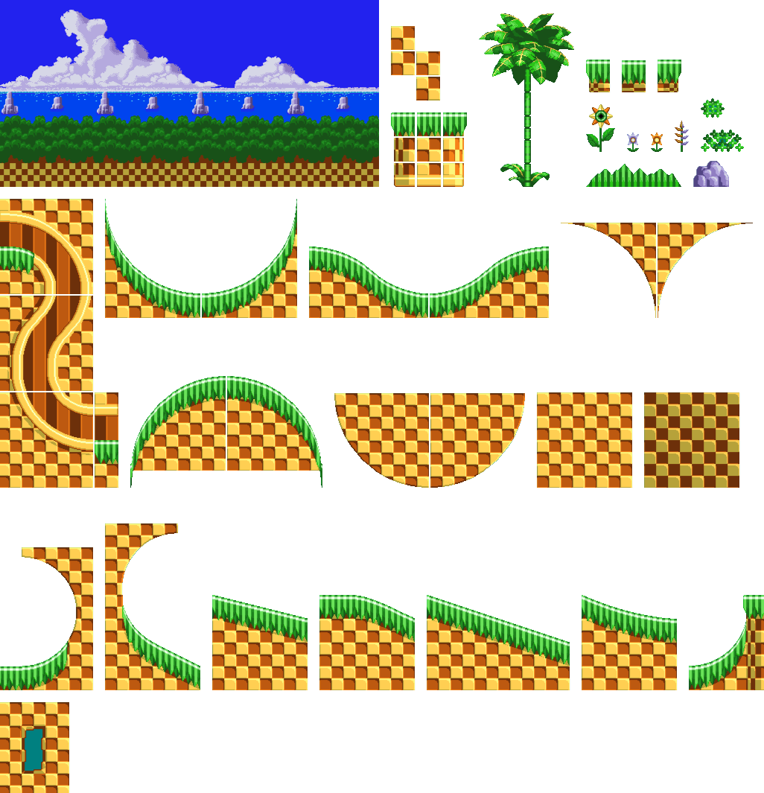

### Recursos gráficos

#### Personaje (Tonyc)

**Tonyc reposo:**

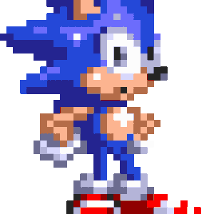

**Tonyc correr:**

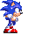

**Tonyc correr rápido:**

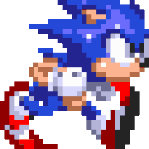

**Tonyc bola:**

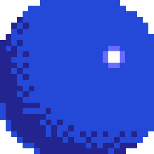


**Tonyc deslizar:**

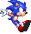

**Tonyc saltar:**

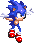

**Tonyc morir:**

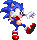

**Tonyc victoria:**

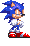

#### Enemigos

**Dr. Eggman:**

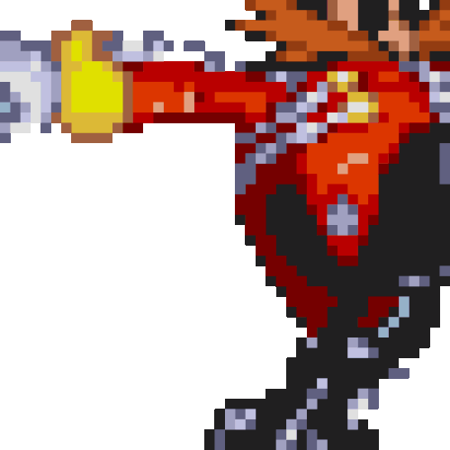

**Mosquito:**


**Pinchos:**


#### Coleccionables

**Monedas:**

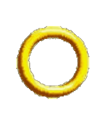

**Vida:**

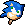


#### Pantallas

**Menú:**

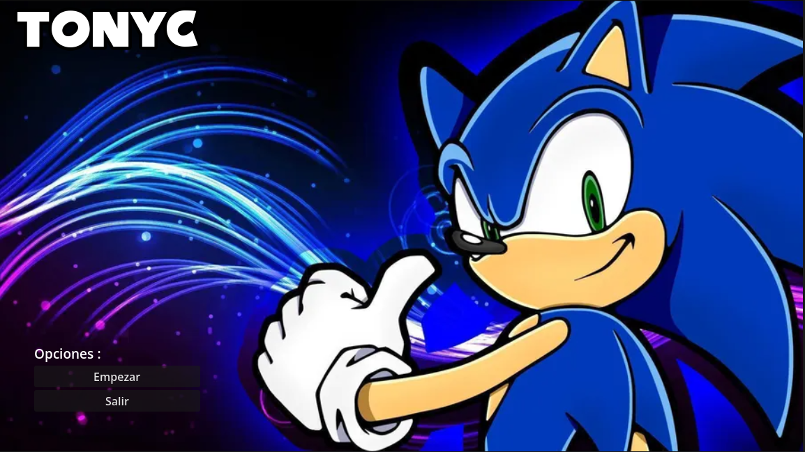

**Pantalla de muerte:**

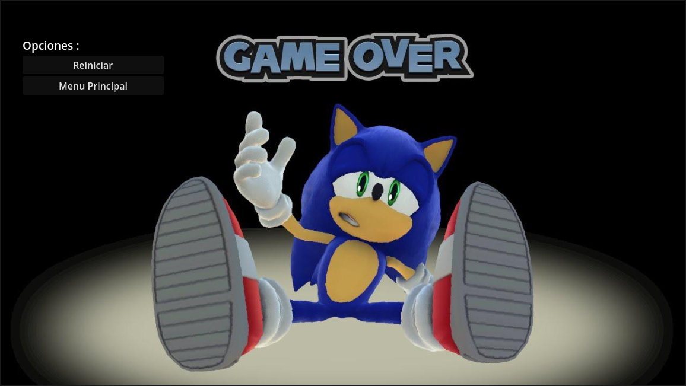

**Fondo:**

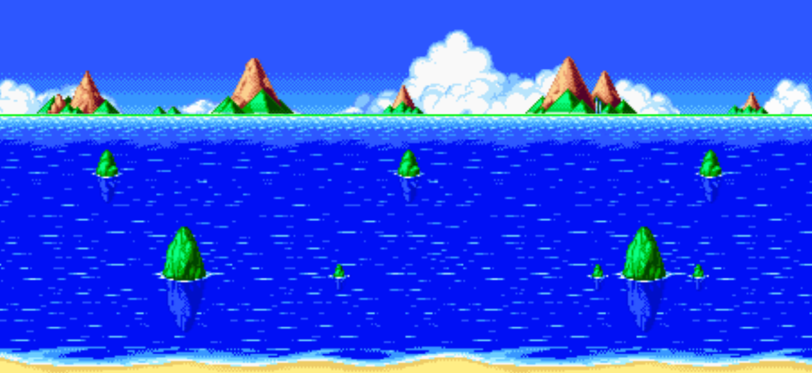

### Sonido
- Música del menú
- Música de muerte
- Música de victoria
- Sonido de monedas

---

## Programación

### Estructura del proyecto
```text
res://
├── coleccionables
│   ├── moneda
│   └── vidas
├── enemigos
│   ├── ene_mosca
│   ├── ene_mregg
│   └── pinchos
├── entorno
│   ├── contador
│   ├── contador_vidas
│   ├── environment
│   └── fondo
├── jugador_sonic
│   ├── img
│   ├── jugador_sonic.gd
│   ├── jugador_sonic.tscn
│   └── victoria.mp3
├── menus
│   ├── menu
│   └── menu_muerte
└── tiles
    ├── img
    ├── tiles.gd
    └── tiles.tscn
```

---

## Elementos destacables del desarrollo (innovaciones y problemas)

### Implementación de físicas

Implementación de físicas para la fluidez de rampas y cuestas mediante la inercia de la bajada y la subida.

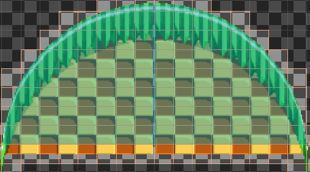

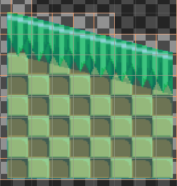

Cabe decir que en Godot se nos hizo bastante complicado el tema de hacer rampas o curvas, ya que hay que hacerlas muy al milímetro. Además, tuvimos que hacer la colisión de Sonic en modo cápsula en vez de rectangular.

### Implementación del modo bola

Otro punto destacable es la implementación del modo rodar de Sonic, la cual nos costó bastante dado que había que aplicar cierta fricción y gravedad al subir y bajar rampas, por ejemplo. El código lo hemos dividido en varias funciones para que quedase todo lo más limpio posible.

También hemos hecho que tenga un *boost* al entrar en modo bola.

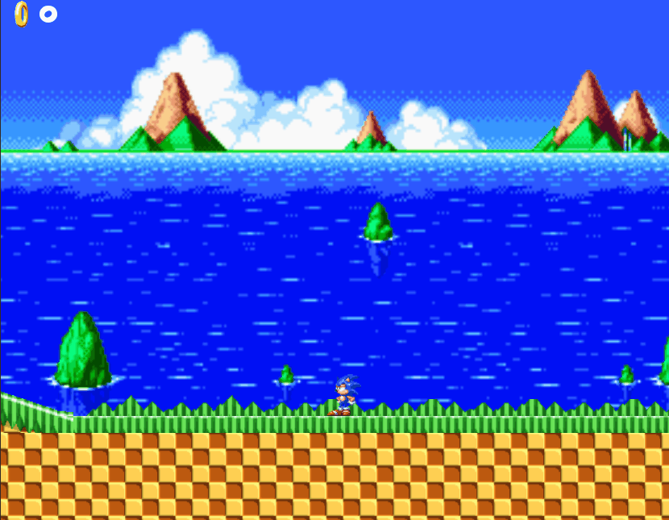

### Implementación del *spawn* de enemigos

En este caso, en el enemigo hacemos que aparezcan justo encima de él moscas; esto lo hará cada 4 segundos, más o menos. Estas moscas, cuando hacen *spawn*, van directamente a por Sonic, ya que tienen su posición en todo momento, y tardarán en morir unos 3 segundos.

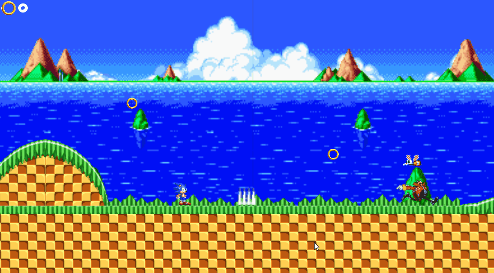

El único problema fue que Sonic, en su propia escena, no estaba centrado en la posición, entonces en el *environment* las moscas no iban a por el Sonic que se veía, sino a su posición real, en la cual él no estaba, claro.
